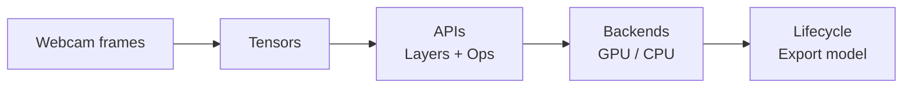
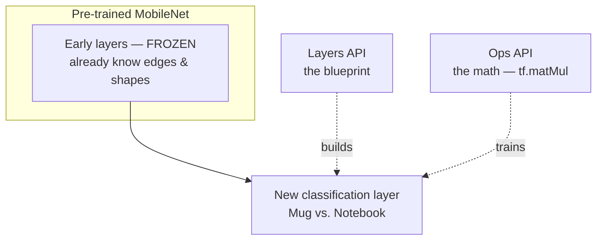
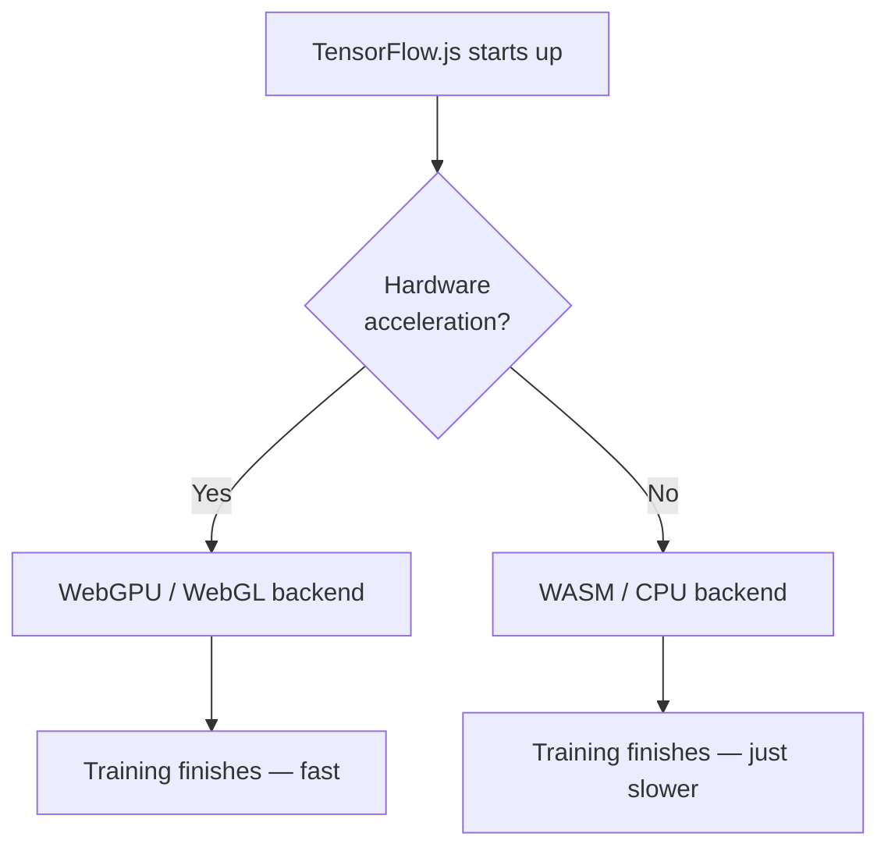

# Watching TensorFlow.js Come Alive --- A Peek Inside Teachable Machine

## A Machine You Can Teach in Your Browser

<!--more-->

Picture this:
you point your webcam at a coffee mug, click a button a few times, then hold up a notebook and click a few more.
Thirty seconds later, your browser can tell the two apart — no code, no cloud, no PhD required.

That's [Google's Teachable Machine](https://teachablemachine.withgoogle.com/) (TM).

But here's the wild part — that friendly little UI isn't magic. Every button you press is quietly driving the entire **TensorFlow.js** engine underneath.

In my [last post](https://linjing-g.github.io/2026/tensorflowjs/), we met the four big ideas of TensorFlow.js: **tensors**, the **APIs**, the **backends**, and the **model lifecycle**. Today, let's trace exactly what happens under the hood — step by step — as you teach a browser to recognize you holding a coffee mug versus a notebook.

## Tensors --- When You Hold Up the Mug

You click **"Hold to Record"** under Class 1, and your webcam starts capturing a stream of raw image pixels.

But here's the catch: JavaScript can't just hand a grid of pixels to a neural network and hope for the best.

So TensorFlow.js steps in. It intercepts each webcam frame and reshapes that grid of red, green, and blue pixels into a **tensor** — a neat 3D (or 4D) box of numbers the network actually understands.

And because tensors are **immutable**, every single frame you capture spins up a fresh tensor:

> A new frame means a new tensor — never an edit to an old one.

Each of these tensors is shipped straight to your device's **GPU memory** whenever available, so it can be crunched instantly — without freezing your browser tab.

##  The APIs --- When You Hit "Train Model"

Teachable Machine doesn't learn from scratch. It stands on the shoulders of a **pre-trained base model** (usually MobileNet) that already knows what lines, edges, and shapes look like.

This is where TensorFlow.js's two API layers team up.

**The Layers API — the blueprint.**
When the page loads, it sketches out the network's high-level design. In plain words, it tells TensorFlow.js:

> "Keep all of MobileNet's early layers frozen — they already understand shapes. Just add a fresh, empty classification layer at the end for *Mug* vs. *Notebook*."

**The Ops API — the math.**
The moment you hit **Train Model**, the **eager execution** engine wakes up. The Ops API fires off rapid-fire math behind the scenes — matrix multiplications (`tf.matMul`), weight adjustments, epoch after epoch — until the network finally learns to tell your two objects apart.

## Backends --- Why Your Fan Might Start Spinning

A little loading wheel appears. Training has begun — and somewhere, your laptop fan might quietly kick in.

**Choosing the engine.**
Before the very first calculation runs, TensorFlow.js takes a quick look around your browser. Spots a modern setup with hardware acceleration? It hands the heavy math straight to the **WebGPU** or **WebGL** backend.

**The fallback plan.**
That choice is made once, at startup — not quietly swapped halfway through. So if you're on an older tablet or a locked-down laptop where the GPU is off-limits, TensorFlow.js simply starts on another registered backend, like **WASM** or plain **CPU**.

The result is the same either way:

> The training still finishes — it just takes a little longer.

## Lifecycle --- When You Click "Export Model"

The bar hits 100%. Just like that, you've built a working, custom brain — living entirely inside a browser tab.

**Saving the state.**
Choose to download or upload, and the lifecycle loop packages your freshly tuned weights into small binary array files, bundled alongside a `model.json` that maps out the network's structure.

**Closing the loop.**
Now you can drop those files anywhere — a totally separate web project, a Node.js server, even a hardware device. Because the architecture stays identical, your exported model spins right back up on whatever device your user is holding, ready to read new tensors all over again.

## From a Coffee Mug to the Bigger Picture

So the next time you casually train Teachable Machine to spot your mug, remember what's really going on:

pixels becoming tensors, a frozen giant lending its knowledge, an engine picking the fastest path it can find, and a tidy little brain packed up to travel the world.

The same four ideas — tensors, APIs, backends, lifecycle — power everything from a webcam to the serious machine learning running across the web.

One you can build in thirty seconds,
and one that's quietly redefining how the world is recognized.

Cheers!

## Reference

- <https://teachablemachine.withgoogle.com/>
- <https://www.tensorflow.org/js>
- <https://en.wikipedia.org/wiki/MobileNet>

